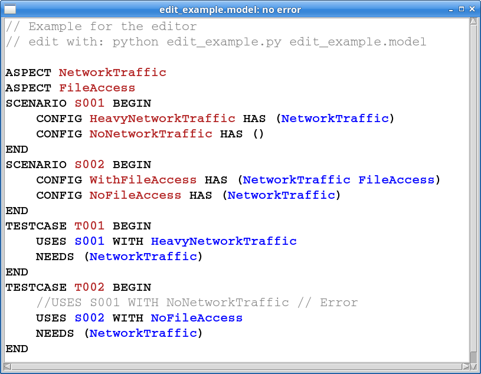

# TextX simple editor support

## Strategy

Allow to use the parsed model or any error (syntax or semantic) occuring
while parsing a model file. Once a model is parsed successfully, we get
correct editor formatting information (syntax highlighting). In case of 
errors, the format information is untouched, only errors are overlaid.

## Model and  meta model support structures

 * metamodel._tx_model_file_access allows to access model sources after
   model parsing. It also allows to hook into any model file access in order
   to provide in-memory model text instead of file data.
 * textx.editor.parsetree_processor allows to iterate over the parsed model
   text. I also provides a convenience classification of text elements
   (e.g. REFERENCE, KEYWORD, COMMENT, ...) in order to ease editor 
   activities, such syntax highlighting.
 * textx.editor.tk_gui a simple tk editor component.

## Open Points, NOGOs

 * NOGO: Syntax highlighting works only, if the complete model is readable,
   While typing large model elements, no syntax highlighting updates occur...
     * Can we have "half-parsed-models"?
 * NOGO: We need something like: "complete currently expected terminal"...
 * Open Point: check how to link the references to the real objects they 
   point to (in order to allow "go to definition").

--> textx-tools probably provide suitable modules to overcome some or all of
the problems above...

## Usage

Example: textX/examples/mini_examples/edit_example.py
